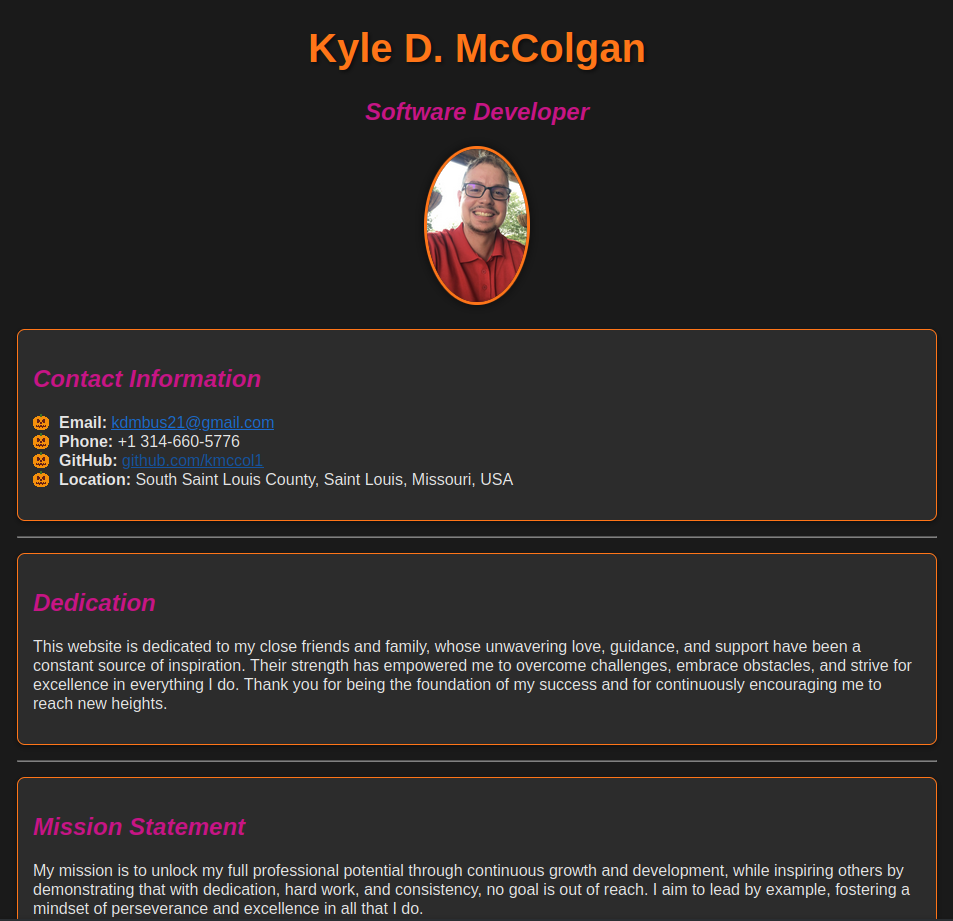

# Kyle McColgan – Personal Portfolio

Welcome to my personal portfolio! This site showcases my projects, skills, and experience in web development and IT security. Feel free to explore my work and get in touch if you'd like to collaborate or learn more about my background.



## About Me

Hi, I'm Kyle! I'm a web developer and IT security enthusiast based in Saint Louis with a focus on creating efficient, user-friendly websites and secure, scalable network solutions. With experience in front-end development, network programming, and information security, I bring a balanced approach to both usability and security in every project. My work emphasizes high performance, resilience, and a seamless user experience, whether I’m designing a web interface or building backend functionality.

Feel free to explore my projects—I'd love to connect with others who are passionate about building innovative, secure tech solutions. Let’s create something great together!

## Skills
- Programming Languages: Experienced in HTML, CSS, and JavaScript for web development, and C++ for building efficient applications.
- Web Development: Focused on front-end development with an emphasis on creating responsive and accessible user interfaces.
- Cybersecurity: Knowledgeable in network programming, IT security fundamentals, and secure coding practices, with practical experience in network analysis.

## Vision
I am committed to crafting secure, scalable, and user-centric solutions in web development and network security. My mission is to create accessible digital experiences that empower users, advance cybersecurity practices, and set new standards in usability and performance. Driven by curiosity and a growth mindset, I continuously seek out learning opportunities to stay at the forefront of technology. I envision a future where my work not only keeps pace with the evolving tech landscape but also contributes meaningfully to the safety, inclusivity, and integrity of the digital world.

## Key Projects

### 1. [HostRecon](https://github.com/kmccol1/hostRecon)
A C++ network scanner using libpcap to detect active hosts on a network. This project strengthens network security by helping identify unauthorized or suspicious devices in real-time.

### 2. [Portfolio Website](https://kmccol1.github.io/kyle-mccolgan)
This website is built with HTML and CSS and is fully responsive, showcasing my web development skills. Check out the source code in this very repository.

## Technologies Used

- Languages: HTML, CSS, JavaScript
- Testing Framework: Jest, for unit testing JavaScript functionality
- Deployment: GitHub Pages, for hosting and continuous integration
- Version Control: Git, managed through GitHub for code versioning and collaboration

## How to Use

To explore the site locally:
1. Clone the repository:
    ```bash
    git clone https://github.com/kmccol1/kyle-mccolgan.git
    ```
2. Open `index.html` in your browser to view the website.

## Future Plans
- **Enhanced Interactivity:** Integrate more interactive elements using JavaScript.
- **Security Enhancements:** Apply advanced techniques for secure web development.
- **Portfolio Expansion:** Continue adding more projects focused on C++ and cybersecurity.

## Contact
I'm always open to discussing new opportunities, collaboration, or answering any questions about my work. Feel free to reach out through any of the platforms below:

- **Email:** kdmbus21@gmail.com
- **LinkedIn:** [Kyle McColgan](https://www.linkedin.com/in/kylemccolgan/)
- **GitHub:** [kmccol1](https://github.com/kmccol1)

Thank you for visiting my portfolio! Feel free to reach out with any questions or opportunities.
