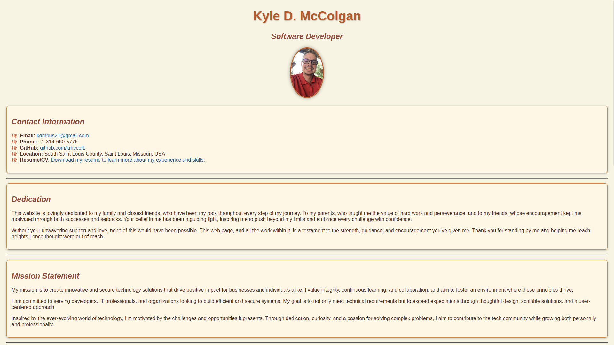

# Kyle McColgan – Personal Portfolio

Welcome to my personal portfolio! This repository houses the source code for my personal website, built to showcase my skills, projects, and journey in web development and IT security. Explore my work and feel free to reach out if you'd like to collaborate or learn more.



## About Me

Hi, I'm Kyle McColgan—a developer and security enthusiast based in Saint Louis. I specialize in building efficient, user-friendly websites and secure, scalable network solutions. My approach balances usability and security, ensuring high performance and seamless user experiences across all my projects.

I'm always excited to connect with others in the tech community. Whether it's collaborating on a project or sharing knowledge, let’s create something impactful together!

## Skills

- **Programming Languages:** Proficient in HTML, CSS, JavaScript, and C++ for efficient and secure solutions.
- **Web Development:** Focused on creating responsive, accessible, and user-centric designs.
- **Cybersecurity:** Hands-on experience with network programming, IT security fundamentals, and secure coding practices.

## Vision

I am committed to crafting secure, scalable, and user-centric solutions in web development and network security. My mission is to create accessible digital experiences that empower users, advance cybersecurity practices, and set new standards in usability and performance. Driven by curiosity and a growth mindset, I continuously seek out learning opportunities to stay at the forefront of technology. I envision a future where my work not only keeps pace with the evolving tech landscape but also contributes meaningfully to the safety, inclusivity, and integrity of the digital world.

## Key Projects

### 1. [HostRecon](https://github.com/kmccol1/hostRecon)
A C++ network scanner leveraging libpcap to detect active hosts, enhancing network security by identifying unauthorized devices.

### 2. [Portfolio Website](https://kmccol1.github.io/kyle-mccolgan)
A fully responsive HTML and CSS website showcasing my web development expertise. This repository contains its source code.

## Technologies Used

- **Languages:** HTML, CSS, JavaScript
- **Testing Framework:** Jest, for unit testing JavaScript functionality
- **Deployment:** GitHub Pages for hosting and CI/CD
- **Version Control:** Git, managed through GitHub for collaboration and tracking changes

## How to Use

To explore the website locally:

1. Clone the repository:
    ```bash
    git clone https://github.com/kmccol1/kyle-mccolgan.git
    ```
2. Open `index.html` in your browser to view the site.

## Future Plans

- **Enhanced Features:** Introduce dynamic, interactive components using JavaScript.
- **Security Upgrades:** Adopt advanced secure web development practices.
- **Project Showcase:** Add more projects highlighting C++ and cybersecurity work.

## Contact

I'm always open to new opportunities, collaborations, or discussions about technology. Feel free to connect with me:

- **Email:** [kdmbus21@gmail.com](mailto:kdmbus21@gmail.com)
- **LinkedIn:** [Kyle McColgan](https://www.linkedin.com/in/kylemccolgan/)
- **GitHub:** [kmccol1](https://github.com/kmccol1)

Thank you for visiting my portfolio repository. I look forward to connecting!
